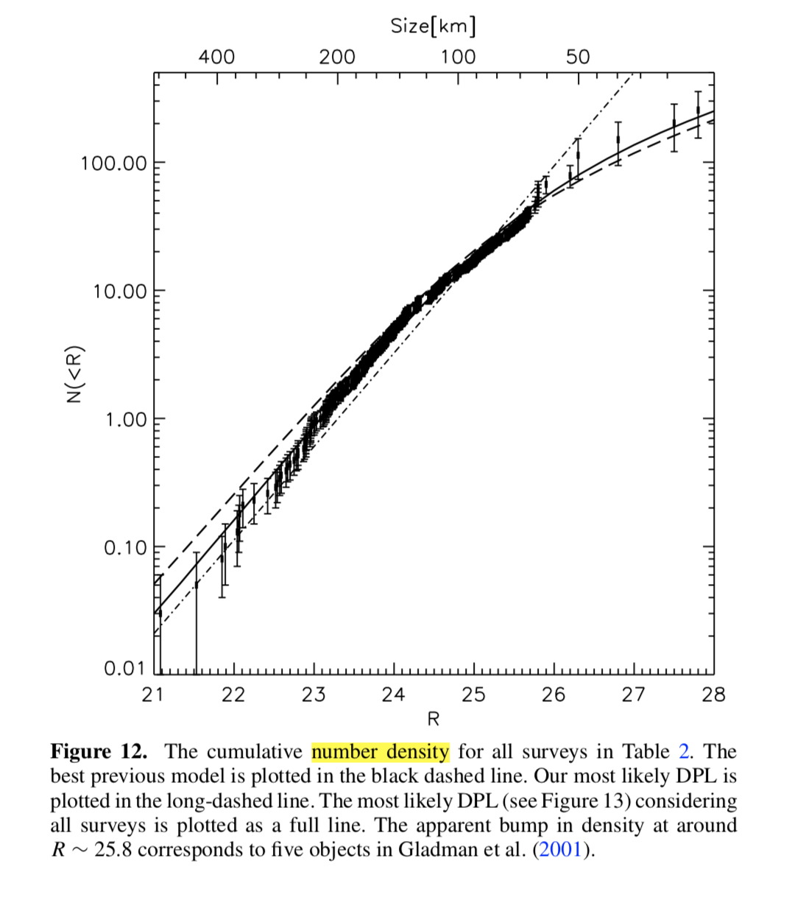

------------------------------------------------------------

#### 6/18/18: Flare analysis  

I've created a new folder called `stellar_analysis` in the `band6` directory.
`flare_scripts` contains all the code, from creating measurement sets to extracting imfit fluxes and positions.

1. Flare position:
```python 
import numpy as np
from uncertainties import ufloat, umath
# imfit positions in arcseconds:
noflare_ra  = ufloat(-0.8501300574337373 * 180/np.pi * 3600, 0.021112856077985704) 
noflare_dec = ufloat(-0.5470290568647891 * 180/np.pi * 3600, 0.013264360833506577)
flare_ra    = ufloat(-0.8501304925293767 * 180/np.pi * 3600, 0.003768824116591783)
flare_dec   = ufloat(-0.5470294252558661 * 180/np.pi * 3600, 0.0023169999050442177)

sep_ra = noflare_ra - flare_ra
sep_dec = noflare_dec - flare_dec
sep_tot = umath.sqrt( sep_ra**2 + sep_dec**2) # 0.118+/-0.019 arcsec
```
2. 


------------------------------------------------------------

#### 6/8/18: scaling values in the literature by Gaia distance

```python 
from uncertainties import ufloat
dist_old = ufloat(9.9, 0.10)
gaia_parallax = ufloat(102.82949372268861, 0.04856132557548943) 
dist_gaia = 1000. / gaia_parallax
scaling_factor = (dist_gaia / dist_old)**2

M_dust = 0.010*scaling_factor; print(M_dust)# 0.00965+/-0.00020
M_dust_Liu = 0.011*scaling_factor; print(M_dust_Liu) # 0.01061+/-0.00021

macgregor_stellar_flux = ufloat(320, 60) * scaling_factor
print(macgregor_stellar_flux) # 310+/-60 

macgregor_r_in_lower = ufloat(8.8, 1) * scaling_factor 
macgregor_r_in_upper = ufloat(8.8, 11) * scaling_factor 
print(macgregor_r_in_lower, macgregor_r_in_upper) # 8.5 +11.0/-1.0
macgregor_r_in_3sigma = 21 * scaling_factor; print(macgregor_r_in_3sigma)


macgregor_r_out = ufloat(40.3, 0.4) * scaling_factor
print(macgregor_r_out) # 38.9+/-0.9

```

------------------------------------------------------------

#### 6/7/18: Notes on Eugene's Email

[Quillen (2006):](http://articles.adsabs.harvard.edu/pdf/2006MNRAS.372L..14Q)  

> We denote the free eccentricity dispersion, $u_e^2 = \langle e_{proper}^2 \rangle$. 
> The slope of Fomalhaut’s disc edge $h_r / r \leq 0.026$ so the free eccentricities in the disc edge are $u_e \leq 0.026$.

this seems to contradict Quillen (2007), where $e = 2i = 2\sqrt{2}h$...


[Quillen & Faber (2006)](https://arxiv.org/pdf/astro-ph/0608059.pdf)
has eccentricity dependence


------------------------------------------------------------

#### 6/5/18: Plavchan Luminosity Recalculation

From Plavchan et al. (2009):

> PHOENIX NextGen models are used to fit the observed optical and near-IR photometry rather than a blackbody, since the stellar SEDs are very different from that of a blackbody at optical and near-IR wavelengths (Hauschildt et al. 1999a, 1999b; Gray 1992; Mullan et al. 1989).
> To fit the NextGen spectra to the available photometry, we compute a $\chi^2$ minimization as a function of effective temperature and normalization. We integrate model photospheres as a function of wavelength across effective bandpasses to compare to observed photometry for a given band.
> Radii are fitted to the nearest 0.5% and the uncertainty is dominated by the uncertainty in the trigonometric parallax.

I don't think calculating $R_\star$ from a magnitude will work, due to the first sentence above..

$$L = 4 \pi R_\star^2 \sigma T_{eff}^4$$
$$f = \frac{L}{4 \pi d^2} \implies L = f \cdot 4 \pi d^2$$

- Plavchan recalculations:
``` python
import numpy as np
from uncertainties import ufloat
import astropy.units as u
import astropy.constants as c

R_plav = 0.84*u.Rsun
L_plav = 0.09*u.Lsun
T_plav = ufloat(3500, 100) * (1*u.K) # K
L_calc_plav = (4 * np.pi * R_plav.si**2 * c.sigma_sb.to(u.Lsun / (u.m**2 * u.K**4)) * T_plav**4);
L_calc_plav #0.09489585020444333+/-0.010845240023364951
```
Recalculating Plavchan's luminosity (and propagating errors on $T_{eff}$) yields a consistent result, when rounded.

- Accounting for new Gaia distance by simply scaling Plavchan's quoted result:
```python
dist_old = ufloat(9.9, 0.10) * (1*u.pc)
gaia_parallax = ufloat(102.82949372268861, 0.04856132557548943) 
dist_gaia = 1000. / gaia_parallax * (1*u.pc); #9.724836365496536+/-0.004592563162732345

L_gaia = L_plav * (dist_gaia / dist_old)**2; L_gaia #0.08684338139181255+/-0.0017563281201353898
```

- By scaling recalculated Plavchan Luminosity:
``` python
L_gaia_scaled_L = L_calc_plav * (dist_gaia / dist_old)**2; L_gaia_scaled_L #0.09156751679783094+/-0.010627450100927275
```

In sum, when the quoted luminosity of 0.09 is scaled by the new Gaia distance, we find a new luminosity of 0.0868. Rounding to one sig fig, this doesn't change anything.
Furthermore, I think Plavchan calculated a luminosity of 0.0948 but rounded it to 0.09 in the table.
Scaling the recalculated luminosity of 0.0948 by the new Gaia distance yields 0.0916, which is actually still larger than the quoted value of 0.09.
So on both accounts, I think we are justified in keeping the model stellar luminosity at 0.09.


------------------------------------------------------------

#### 3/31/18: Local Intensity Maxima Offset

- NW: 7.3
- SE: 10.5

------------------------------------------------------------

#### 3/31/18: Questions for Zach re: AU Mic Gas

1. for the AU Mic standard keplerian model, which model parameters are fixed and which are free parameters?

------------------------------------------------------------

#### 3/31/18: New Gaia distance

```python
from uncertainties import ufloat
gaia_parallax = ufloat(102.82949372268861, 0.04856132557548943) 
gaia_dist = 1000. / gaia_parallax; #9.724836365496536+/-0.004592563162732345
print(gaia_dist)

```
------------------------------------------------------------

#### 4/16/18: Annulus residual reduction

from ds9 region statistics:
- upper right: 56 $\mu$Jy reduced to 39 $\mu$Jy
- star: 46 $\mu$Jy reduced to 40 $\mu$Jy
- lower left: 45 $\mu$Jy reduced to 36 $\mu$Jy
 
------------------------------------------------------------

#### 4/15/18: Smallest spatial scale

``` python
import numpy as np
import astropy.units as u
longest_baseline= 1320.*u.m / (1.4*u.mm)

angular_scale = np.degrees(1 / longest_baseline.decompose().value)*3600
angular_scale # 0.21876570359540523
spatial_scale = angular_scale * 9.725; spatial_scale # 2.1274964674653156
```

------------------------------------------------------------

#### 4/14/18: Macgregor flux density comparison

``` python
from uncertainties import ufloat, umath
import astropy.units as u; import astropy.constants as c

# calculate scaling factor
mac_mean_freq = 235e9 * u.Hz
mac_mean_wav = np.round((c.c / mac_mean_freq).to(u.mm), 2);
mac_mean_wav.value # 1.28 mm

our_mean_freq = 222.1e9 * u.Hz
our_mean_wav = np.round((c.c / our_mean_freq).to(u.mm), 3)
our_mean_wav.value # 1.350 mm

# have to pick a temperature for scaling factor; MacGregor uses 25 K ("for 35-45
# au") when calculating a dust mass. by my calculations, T(37 au) ~ 25 K
T = 25*u.K 
peak_wav = (c.b_wien / T).to(u.mm) # 0.115910916 mm
# because peak wavelength is smaller than observing wavelength by a factor of ten,
# the scaling factor between MacGregor's 1.28mm flux and our value of 1.350 mm 
# flux should be < 1. 

scaling_factor = (our_mean_freq / mac_mean_freq)**3 \
    * (np.exp( c.h * mac_mean_freq / (c.k_B * T) ) - 1) \
    / (np.exp( c.h * our_mean_freq / (c.k_B * T) ) - 1) # 0.9051713845664854

# scale disk flux
mac_disk_flux_lower = ufloat(7.14,0.25) * (1*u.mJy)
mac_disk_flux_upper = ufloat(7.14,0.12) * (1*u.mJy)
print(scaling_factor*mac_disk_flux_lower) # 6.46+/-0.23 mJy
print(scaling_factor*mac_disk_flux_upper) # 6.46+/-0.11 mJy 
# compare to our value of 4.80 +/- 0.17 mJy

# scale star flux using Plavchan's effective temperature
T_plav = ufloat(3500, 100) * (1*u.K) # K
scaling_factor = (our_mean_freq / mac_mean_freq)**3 \
    * (umath.exp( (c.h * mac_mean_freq / (c.k_B * T_plav)).value ) - 1) \
    / (umath.exp( (c.h * our_mean_freq / (c.k_B * T_plav)).value ) - 1) 
    # 0.8933051+/-0.0000023
    
mac_star_flux = ufloat(0.32, 0.06) * (1*u.mJy)
print(mac_star_flux*scaling_factor) # 0.29+/-0.05 mJy
```
------------------------------------------------------------

#### 4/14/18: M star flare notes

~ 6.4 % M stars are active; periods of activity up to 10 days?
https://www.sciencedirect.com/science/article/pii/S1384107615001268

modeling of M star radio emission seems to predict / fit data with variability from 0.5 to 1 mJy over a 0.44 day rotation period
http://iopscience.iop.org/article/10.3847/1538-4357/aaa59f/pdf

The emission from the Algol system is known to be highly variable and of very high brightness temperature (~109 K) (Lestrade et al. 1988). More specifically, it has been identified as gyrosynchrotron emission from mildly relativistic electrons accelerated by magnetic reconnections in its stellar chromosphere (as also known for Sun and other stars). The spectrum of such emission peaks at a few centimetres, and may extend into the millimetre wavelength domain (Dulk 1985). The flux observed at 850 $\mu$m therefore might be such a tail, rather than thermal emission from a debris disc. The recently measured variability of the millimetre flux density observed at the SMA strengthens this interpretation (Wyatt/Wilner, private communication).... 
Hence, although it may be possible for a debris disc to exist around Algol, evidence from longer wavelengths points to the emission at 850 $\mu$m being due to radio variability rather than a debris disc.
https://ui.adsabs.harvard.edu/#abs/2017MNRAS.470.3606H/abstract

radio variability on timescales of days, even weeks to months?
http://iopscience.iop.org/article/10.3847/1538-4357/aa7aa4/pdf

more (14) radio variable sources, some M stars; minutes-days timescales
http://iopscience.iop.org/article/10.1088/1674-4527/17/10/105/meta

paper about variability in debris disks
http://iopscience.iop.org/article/10.1088/2041-8205/765/2/L44/pdf

------------------------------------------------------------

#### 4/11/18: Metchev PA
```python
from u  ncertainties import ufloat

NW = ufloat(130.1, 0.2) 
SE = ufloat(129.5, 0.4) 
(NW + SE) / 2 
- ufloat(128.49, 0.07)
```

------------------------------------------------------------

#### 4/10/18: Discussion calculations

Calculating the size of the largest possible body, assuming Earth density
`w (1.5 M_earth / (4/3 * pi * 5.5 g/cm^3))^(1/3) in earth radii`

Calculating stirring extent for a single stirring body:
`w 5*40 au * (1.5 M_earth / (3*0.5 M_sun))^(1/3)`

Calculating stirring extent for a Neptune  
`w 5*35 au * (15 M_earth / (3*0.5 M_sun))^(1/3)`  
`w 5*47 au * (15 M_earth / (3*0.5 M_sun))^(1/3)`  
- average of 5 and 7 $\implies$ 6 au 

Calculating number of bodes of size 340 km:  
`w 1.5 M_earth / (4/3*pi*(340km)^3 * 2 g/cm^3)`  

------------------------------------------------------------

#### 3/31/18: Scale height dectability

```python
import numpy as np; import matplotlib.pyplot as plt
H = 1.2 # au
au_s = np.arange(-3,3,0.01)
gauss = 23 * np.exp(-1. * (au_s / H)**2)
SNR_3_FW_au = np.abs(au_s[np.where(gauss < 3)]).min() * 2 # 
SNR_3_FW_au # 3.4399999999997988 full width of >3 sigma emission
SNR_3_FW_arcsec = SNR_3_FW_au / 9.725 # 0.35372750642671452
```
------------------------------------------------------------

#### 3/31/18: Distance uncertainty propagation

```python
from uncertainties import ufloat
parallax = ufloat(100.91, 1.06)
dist = 1000 / parallax;
dist = 9.909820632246557+/-0.10409681766109753

gaia_parallax = ufloat(102.82949372268861, 0.04856132557548943)
gaia_dist = 1000 / parallax;
gaia_dist

```
------------------------------------------------------------

#### 3/1/18: All calculations in one place

1. Aspect ratio $\to$ escape velocity:
    - $<v_{rel}>\ \sim\  h\sqrt{\frac{12 G M_\star}{r}}\ \sim\ v_{esc}(s_{big}) \approx 357.6$ m/s  
      - `w 0.031 * sqrt(12 * G * 0.5 M_sun / (40 au))`  
      - $\sigma = \sigma_h \sqrt{\frac{12 G M_\star}{r}} = 57.68$ m/s  
        - `w 0.005 * sqrt(12 * G * 0.5 M_sun / (40 au))`  

2. Escape velocity can be related to the particle's mass and size, assuming a density:  
  $$v_{esc} (s_{big}) = \sqrt{\frac{2 G M_{big}}{s_{big}}} = s_{big}\sqrt{\frac{8 \pi G \rho}{3}}$$
    - $s_{big} = v_{esc} \sqrt{\frac{3}{8 \pi G \rho}} = 338.2$ km  
      - `w 357.6 m/s * sqrt( 3 / (8 * pi * G * 2 g/cm^3)) in km`  
      - $\sigma = \sigma_v \sqrt{\frac{3}{8 \pi G \rho}} = 54.55$ km  
        - `w 57.68 m/s * sqrt( 3 / (8 * pi * G * 2 g/cm^3)) in km`
    - $M_{big} = \frac{v_{esc}^2 s_{big}}{2 G} \approx 3.24 \times 10^{20}$ kg 
      - `w (357.6 m/s)^2 * 338.2 km / (2 * G)` 
      - ${\displaystyle \sigma={\sqrt {\left({\frac {\partial M}{\partial v}}\right)^{2}\sigma_{v}^{2}+\left({\frac {\partial M}{\partial s}}\right)^{2}\sigma_{s}^{2}}}} = 1.098 \times 10^{20}$ kg
        - `w sqrt( (54.55 m/s * 2 * 357.6 m/s * 338.2 km / (2*G))^2  + (50 km * (357.6 m/s)^2 / (2*G))^2)`  
3. Stirring zone of influence is 6 Hill radii:  
$$ 
  \Delta r \sim 6 {r_{\mathrm {H} } \approx 6a{\sqrt[{3}]{\frac {m}{3M}}}} 
$$
  All calculations @ 40 au
    - Lower limit $m = M_{big} \implies \Delta r = 0.1145$ au.  
      - `w 6 * 40 au * (3.24e20 kg / (3 * 0.5 * M_sun)) ^(1/3)`
    - Upper limit $m = 2.3 M_{\oplus} \implies \Delta r = 3.993$ au.  
      - `w 6 * 40 au * (2.3 M_earth / (3 * 0.5 * M_sun)) ^(1/3)`
4. Number of Kuiper Belt Objects:  
    1. Fuentes & Holman 2008:  
        - Bias corrected, etc.; should be representative of total population of TNOs. 
        - Covers a solid angle of $\Omega = 21,600$ square degrees
        - _Cumulative density plot:_ (I think this is surface density?)
          
          - $\implies \Omega N(100\ km) \sim 361,600$
          - $\implies \Omega N(340\ km) \sim 4520$
    2. Assuming 100,000 KBOs from [archived New Horizon's blog](https://web.archive.org/web/20141113225430/http://pluto.jhuapl.edu/overview/piPerspective.php?page=piPerspective_08_24_2012) and [NASA's Kuiper belt page](https://solarsystem.nasa.gov/solar-system/kuiper-belt/overview/) and $q=4$:
      $$
        N(100\ km) = \beta 100^{-3} \sim 100,000 \implies \beta = 1e11\\
        N(340\ km) = \beta 340^{-3} \sim 2544
      $$
    


------------------------------------------------------------

#### 2/23/18: Meeting with Margaret & Hilke

- **Questions**
  - How do we go from $M_{dust}$ and $H$ to a total dynamical mass? Without knowledge about $p$ and $q$?
    - because there's essentially no damping, the disk becomes more and more dynamically hot over time. Because of this we can mostly make 
    - this is the mass ABOVE the collisional cascade
  - Can we make a more accurate estimate if we use Evan's $p$ and $q$ values?
  - What went into the plot from the Band 6 proposal?
    - assume equipartition, **if** eccentricities/inclinations are less than their Hill eccentricities/inclinations
      - this comes from finding Hill radius of particles and... keplerian shear
    - Gravitational stirring, collisional damping; bigger things stir faster
    - typical velocity $\to$ combination of stirring and damping rates $\to$ size of biggest bodies
    - assume how effective collisional damping is
      - when total mass of collided bodies equals mass of colliding body, body is effectively damped.
    - assume planet is embedded in disks
      - 6 hill radii; dependent on disk velocity?
    
- Because $\Delta p \sim 0$, damping is very effective; like Kuiper Belt
- Original assumption (single-velocity collisional cascade), damping is negligible 
- $q$ tells us about how the bodies are held together; probably not gravity dominated 
- low $q$ implies that not much KE is lost in collisions
- particles may not be circular at mm sizes; this makes the internal strengths even weaker $\to$ porous grains held together my molecular bonds
- generally, strength are predicted to increase as $a \to 0$; we're finding the opposite.
- 

------------------------------------------------------------

#### 2/11/18: Making a Plan  

##### Conventions:  
- $a_d$ is grain size traced by observations  
- $a_{top}$ is size of largest body in cascade  
- $a_{max}$ is size of largest body in disk  
- $v_{rel}$ is encounter velocity dispersion or impact velocity
- $v(r)$ is velocity dispersion function

##### Known Qauntities: 
- $h(a_d)$
- $M_{dust}$
- $\bar{\tau} (\lambda) \to \tau_d$ (or the latter can be determined from modeling?)
- $\Sigma_d$, either directly from modeling or using Eq. 4 in Quillen

##### Derivable Quantities
- $h(a_d) \to v(a_d) \to v(r)$ with an assumed value for $p$
- $M_{dust} \to N(a=\lambda) \to N(a)$ with an assumed value for $q$
  - this gives us mass, but doesn't use scale height information.
  - also tricky because $q$ isn't well constrained for $a > a_{top}$
- {$\tau_d, v(a_d)$, assumed value for $q$} $\to a_{top}$
  - or can be inferred directly from $v(a_d)$ if $\sim v_{esc}(a_{top})$
- $\Sigma_d, a_d\ \to \Sigma(a) \to \Sigma(a) m (a)$ 
  - $\to \Sigma(a_{top})$
- $\Sigma(a_{max}) m(a_{max})$: puts constraint on surface density of largest bodies, and thus on $q$ for $a> a_{top}$?
 
##### Other Ideas
- Incorporating Pan & Schlichting
  - make a guess about where the strength/velocity regimes lie to choose a better value of $q$? or a series of values for $q$? 
  - Quillen neglects dyanimcal friction from smaller particles... combine with Pan & Schlichting? this sounds awful  

------------------------------------------------------------

#### 2/8/18: Ruminations on Theory  

##### Thebault:
- Impact velocity or 'encounter velocity dispersion' of the observed grains is approximately the same as the escape velocity of the bodies at the top of the cascade: 
  $$v_{rel}(a_d) = v_{esc}(a_{top})$$  
- Equipartition between in-plane and vertical motions: 
  $$<i> = \frac{<e>}{2} \implies  <e>^2 = 4<i>^2$$
  - velocity imparted by dynamical interactions $\to$ eccentriicty is divided equally between the disk plane and vertical direction (inclination $<i> \approx \sqrt{2} h$ )
- Relating observed aspect ratio $h(a_d)$ to escape velocity of largest bodies $v_{esc}(s_{big})$:
  $$<v_{rel}(a_d)>\ \sim\ v_{Kep}(r) \cdot \sqrt{<i^2> + 1.25 <e^2>}\ \sim\ v_{esc}(s_{big})$$
  which can be rewritten as
  $$<v_{rel}(a_d)>\ \sim\ \sqrt{ \frac{G M_\star}{r}} \cdot \sqrt{<i^2> + 5 <i>^2}\ \sim\ v_{esc}(s_{big})\\
  <v_{rel}(a_d)>\ \sim\ \sqrt{\frac{12 G M_\star}{r}} \cdot h(a_d)\ \sim\ v_{esc}(s_{big})$$
  or, in terms of velocity dispersion function:
  $$ v(a_d)\ \sim\ \sqrt{\frac{6 G M_\star}{r}} \cdot h(a_d)\ \sim\ v_{esc}(s_{big})$$
  <!-- - for AU Mic {$r=40$ au, $M_\star = 0.31 M_\odot$, $h(a_d)=0.025$} we have $v_{esc}(s_{big}) = 227$ m/s. Assuming a density of $\rho = 2 \text{ g/cm}^3$ implies: -->
  Escape velocity can be related to the particless mass and size, assuming a density:
  - $v_{esc} (s_{big}) = \sqrt{\frac{2 G M_{big}}{s_{big}}} = s_{big}\sqrt{\frac{8 \pi G \rho}{3}} =$ 
  - $s_{big} = v_{esc} \cdot \sqrt{\frac{3}{8 \pi G \rho}} = j$  
  - $M_{big} = \frac{v_{esc}^2 s_{big}}{2 G} \approx 3.301×10^{20}$ kg    
    - `w (360 m/s)^2 * 340 km / (2 * G)` 
    - ${\displaystyle \sigma_{M}={\sqrt {\left({\frac {\partial M}{\partial v}}\right)^{2}\sigma_{v}^{2}+\left({\frac {\partial M}{\partial s}}\right)^{2}\sigma_{s}^{2}}}} = 1.203  \times 10^{20}$ kg
      - `w sqrt( (60 m/s * 2 * 360 m/s * 340 km / (2*G))^2  + (50 km * (360 m/s)^2 / (2*G))^2)`
  
  
##### Quillen:
- $H \to$ inclination dispersion $\to$ velocity dispersion $\to$ collisional energy $\to$ dust production rate
- "Because the absorption or the emissivity coefficient of a dust grain with radius a is reduced for $\lambda > a$, and there are more dust grains with smaller radii, we expect the optical depth to be related to the number density of particles of radius $a \sim \lambda$"
- Scale height to inclination:
  $$ <z^2>\ \approx\ \frac{r^2 <i^2>}{2} \implies \bar{i} \sim \sqrt{2}h $$ 
  where $\bar{i} = \sqrt{<i^2>}$ and $<i^2>$ is the inclination dispersion
- Number-size scaling relation:
  $$N(a) = N_d \left(\frac{a}{a_d} \right)^{1-q}$$
  - Interparticle velocity dispersion is twice the particle velocity dispersion duh!
  $$ v(r)^2 = \frac{1}{2}v_{rel}(r)^2$$
- *Observables to Theory*
  - $h(a_d) \to v(a_d)$
  - observed normal optical depth $\bar{\tau}(\lambda)\ \to\ \tau(a_d=\lambda) = \tau_d$, the optical depth of grains of size $a_d$
  - $v(a_d), \tau_d, q, \Omega, t_{age}\ \to\ a_{top}$
  - $\Sigma_d, a_d\ \to \Sigma(a_{top})$ (really for any $a \leq a_{top}$)
- $\Sigma(a_{max}) m(a_{max})$ (puts constraint on top of size spectrum?)
    <!-- - (w 10^14.5) g^2/cm^2 / (4/3 * pi * (4 km)^3 * 2 g/cm^3)) -->

##### Pan & Schlichting:
- Differential body size spectrum:
  $$ \frac{dN}{da} \propto a^{-q}\\
   \implies N(a) \propto a^{1-q}$$
  - "number of bodies with radius $\geq a$"
  - "number of podies in logarithmic size interval about a"
- Velocity dispersion function:
  $$ v(a) \propto a^p$$
- 'scale height is of order $v_{rel}/\Omega$'
  $$v_{rel}(a) \sim h(a) \cdot r \cdot \Omega \\
  v_{rel}(a) \sim h(a) \cdot r \cdot \sqrt{\frac{G M_\star}{r^3}}\\
  v_{rel}(a) \sim h(a) \cdot \sqrt{\frac{G M_\star}{r}}$$
  - same as Thebault derivation above (factor of $\sqrt{12}$ aside) 

------------------------------------------------------------

#### 10/15/17: Visibile/infrared scale heights
- schneider14 (optical): 1.5 au (had to measure read off image; compare to the value read off by schuppler, assuming they represent the opening angle radians??!) 
- metchev05 (infrared): 'FWHM ~4'
- krist05 (optical): 1.9 au (elsewhere quoted as 2.5-3.5 AU)

------------------------------------------------------------

#### 10/15/17: 3 sigma extent
To find the 3 sigma extent, in boccaletti_plots.py print the separations corresponding to fit flux < 3*rms.
SE extent = 4.59''
NW extent = 4.32''

------------------------------------------------------------

#### 10/10/17: Fixing Model Grid Resolution 
We've been working on a run to investigate the limits of our spatial resolution, to certify that we have in fact resolve the disk scale height.
We fix the scale factor to 0.003 (~1/15 of the beam size). 
The model image had a bunch of grid resolution problems--it looked like a bunch of superimposed bowties, because the size of the sky plane azimuthal grid elements was too large.
~~I'm setting the number of azimuthal grid points ('nphi') to 251; this corresponds a grid element size of 1 au (~1/4-1/5 the beam size) at 40 au.~~ This wasn't fine enough, had to crank it up to 351.

------------------------------------------------------------

#### 10/10/17: Total Disk Flux
cgcurs in=3sigma_image.im slev=a,1.49e-05 levs1=-3,3,6,9 device=/xs options=stats type=con region=arcsec,box'(-5,-5,5,5)'  
Sum =  1.27731E+00   Flux density =  4.97180E-03 Jy  
Minimum =  9.87927E-07  Maximum =  4.47913E-04 Jy/beam  
Mean =  1.51681E-04  sigma =  8.36131E-05 from     8421 valid pixels  
Data minimum at 231.00 pixels, 217.00 pixels  
Data maximum at 256.00 pixels, 257.00 pixels  
Data minimum at 20:45:09.903, -31:20:33.57  
Data maximum at 20:45:09.845, -31:20:32.37  
------------------------------------------------------------

#### 10/7/17: Final RMS for Journal figures

In response to concerns that the rms noise estimate from the journal-quality CASA cleans may be biased due to sidelobes/AU Mic's shape, I'm getting the rms from the residual clean maps.
I'm calling imstat on the *entire* region, since the noise actually goes down when I define the region as a box in the lower third of the image. 
Might as well use all the information we have!

| weighting         | CASA clean rms | residual clean rms |
|-------------------|----------------|--------------------|
| natural (no taper)| 1.48e-05       | 1.49e-05           |
| natural (taper)   | 1.92e-05       | 2.83e-05           |
Residual clean and dirty rms values were essentially identical. 
CASA and miriad may implement a taper differently; to test this I compare the off-source clean rms of the disk image in CASA and miriad:
| weighting         | CASA clean rms | miriad clean rms |
|-------------------|----------------|--------------------|
| natural (taper)   | 1.92e-05       | 3.51e-05           |
Pretty different! I'm just going to use the CASA clean rmses.

Noting that the residual rms values are higher, one would not be surprised to discover that using this rms value reduces the noise contours even more inthe journal-quality image--in fact, there are no noise contours.

------------------------------------------------------------

#### 10/6/17:

- imstat on $3\sigma$ region of band6_star_all.natural_clean.fits:

| Frequency   |    Velocity   |   Stokes | BrightnessUnit   |    BeamArea |
|-------------|---------------|----------|------------------|-------------|
| 2.21987e+11Hz   |       0km/s   |     I    |    Jy/beam     |   256.908 |
| Npts      |      Sum    | FluxDensity         |  Mean       |     Rms
| 9986 |   1.334832e+00   | 5.195759e-03   | 1.336703e-04   | 1.605511e-04
| Std dev        | Minimum        | Maximum   | region count
| 8.893642e-05  | -1.100369e-06   | 4.490895e-04       | 1

Total flux = Sum / (Npts/BeamArea) = 34.341mJy? 
<!-- Error = rms * Npts = 1.603263285 mJy -->

- star:
  - flux density --> 4.490895e-04
  - coords --> 20:45:09.845 -31.20.32.369
  - in degrees: 311.2910208    -31.3423247
   
- NW ansa:
  - flux density --> 3.291588e-04
  - coords --> 20:45:09.693 -31.20.30.834
  - in degrees: 311.2903875    -31.3418983
    - $\Delta \alpha * \cos \delta = 0.152$ seconds $\cos(-31.3418983) =1.95''$
    - $\Delta \delta = 1.535''$  
 
  ``` python
from uncertainties import ufloat, unumpy
import numpy as np
flux_density = ufloat(3.291588e-04, 1.5e-05)
# uncertainty in position is beam size / SNR
sigma_ra = 0.52 / (flux_density.n / flux_density.std_dev)
sigma_dec = 0.32 / (flux_density.n / flux_density.std_dev)
delta_ra = ufloat(1.95, sigma_ra); delta_dec = ufloat(1.535, sigma_dec)
sep_au_NW = (delta_ra**2 + delta_dec**2)**(1/2) * 9.725
pa_NW = - unumpy.arctan(delta_ra / delta_dec) * 180 / np.pi + 180
print(sep_au_NW, pa_NW) # 24.13+/-0.20, 128.2+/-0.4 
  ```
    
- SE ansa:
  - flux density --> 3.440531e-04
  - coords --> 20:45:10.021 -31.20.34.179
  - in degrees: 311.2917542    -31.3428275
    - $\Delta \alpha = -0.176$ seconds $\cos(-31.3423247) =-2.26''$
    - $\Delta \delta = -1.81''$
    - PA = 128.69
    - 2.896" separation  
 
``` python
flux_density = ufloat(3.440531e-04, 1.5e-05)
# uncertainty in position is beam size / SNR
sigma_ra = 0.52 / (flux_density.n / flux_density.std_dev)
sigma_dec = 0.32 / (flux_density.n / flux_density.std_dev)
delta_ra = ufloat(-2.26, sigma_ra); delta_dec = ufloat(-1.81, sigma_dec)
sep_au_SE = (delta_ra**2 + delta_dec**2)**(1/2) * 10
pa_SE = - unumpy.arctan(delta_ra / delta_dec) * 180 / np.pi + 180
print(sep_au_SE, pa_SE) # 28.95+/-0.20, 128.69+/-0.35 
print(pa_SE - pa_NW) # 0.5+/-0.6
```
  
------------------------------------------------------------

#### 7/27/17:
**Pomodoros:**
1.   Get CASA script going

Need to figure out a way to easily access observation rms for cleaning model images..
-   Hard code them into file?
-   Supply pathname to image for rms?

------------------------------------------------------------

#### 7/27/17:
**Pomodoros:**
1.   Make best fit function output visibilities ready for uvcat
2.   Get uvcat up and running
3.   Make residuals as well as convolved images, and start on casa script

------------------------------------------------------------

#### 7/27/17:
'run5_26walkers_10params' went a little wrong--the first june spw was actually a duplicate of an august spw, so I'm starting run 6 to better describe things.

------------------------------------------------------------

#### 7/16/17:
1000 step run with 16 walkers takes ~57 hours

In `run4_16walkers_7params`, `r_in` seems to prefer a very high value--about 25.
Meredith pointed out this may be because we are oversubtracting the stellar flux, so we've decided to use the unsubtracted visibilities and make the stellar flux a free parameter for each observation (so, three more free paramters).


------------------------------------------------------------

#### 6/30/17:
We have to treat each spectral window seperately, as `uvmodel` can't handle spectral windows. Thus, splitting out each spw and weighting seperately.

------------------------------------------------------------

#### 6/16/17: Reweighting

**note:** I changed the June visibilities name from `aumic_jun_noflare_allspws` to simply `aumic_jun_allspws` since we're certainly not using the flare anymore.


Now that I've (more or less) finished processing the visibilities, I need to reweight them using Kevin's code. There are three important factors for determining good weights:
1. `uvwidth:` the size of the box within which to search for neighboring visibilities in order to calculate standard devation/weight. This value is determined using the time smearing equation (3.194) from Essential Radio Astronomy:
    $$ \Delta t \ll \frac{\theta_s}{\Delta \theta} \frac{1}{2\pi} \implies \text{uvwidth} = 2\pi d_{uv} \Delta t $$
    where $\theta_s$ is the synthesized beam, $\Delta \theta$ is the largest phasecenter offset of concern, and $d_{uv}$ is the median $uv$ distance.
2. `nclose:` the number of points used to calculate the standard devation/weight. If there are not nclose visibilities within uvwidth, the weight is set to zero.
3. `acceptance fraction:` the fraction of points for which weights are sucessfully calculated.

I start by setting `nclose` to 50, and then increase/decrease `nclose` by 1 (while holding `uvwidth` fixed) until the acceptance fraction is just above 0.99.


The procedure to go from CASA `.ms` to correctly weighted visibilities of all file formats is as follows:

```python

#CASA
from glob import glob
mses = glob('*.uvsub.ms')
for ms in mses:
    exportuvfits(vis=ms, fitsfile = ms[:-3] + '.uvf')
    
#put at bottom of var_vis, then run:
uvfs = glob('*.uvsub.uvf')
for uvf in uvfs:
    final_name = uvf[:17] + '_FINAL'
    var_vis(uvf[:-4], final_name)
    create_vis(final_name)
    
#back to casa
from glob import glob
uvfs = glob('*FINAL.uvf')
for uvf in uvfs:
    importuvfits(fitsfile=uvf, vis=uvf[:-4]+'.ms')

```

------------------------------------------------------------

#### 6/16/17: Fixing March
Although I previously said that the March date seemed fine, visual inspection indicates that we are oversubtracting the stellar flux:


Because the March baselines are so short ($450$ m), we are not able to obtain the star flux by fitting a point source to the longest baselines; the flux of the disk is present at even the longest baselines. 
As such, I am employing an image-domain approach. 
I fit a 24th order polynomial to the radial surface brightness profile of the disk, excluding the inner radii where stellar emission is present. 
Using the fit, I am able to derive an estimate of the disk flux at the location of the star, and thus find the star flux. 
Derived values can be found below.

| Component | Flux ($\mu$Jy) | 
|---|---|
| Disk | 781 |
| Star | 367 |

I use the following procedure to subtract the stellar flux from the March visibilities:
``` python
fixvis(vis = 'aumic_mar_allspws.concat.ms', 
    phasecenter = 'J2000 20:45:09.84238 -31.20.32.35898',
    outputvis = 'aumic_mar_allspws.fixvis.ms')
os.system('rm -rf point_fit.cl')
cl.addcomponent(flux=0.000367, fluxunit='Jy', shape='point', 
    dir='J2000 20:45:09.84238 -31.20.32.35898')  
cl.rename('point_fit.cl')  
cl.close()
ft(vis='aumic_mar_allspws.fixvis.ms', complist='point_fit.cl')
uvsub(vis='aumic_mar_allspws.fixvis.ms')
os.system('rm -rf aumic_mar_allspws.fixvis.uvsub.ms')
split(vis='aumic_mar_allspws.fixvis.ms',
    outputvis='aumic_mar_allspws.fixvis.uvsub.ms',
	datacolumn='corrected')
```
The resulting visibilities appear very slighltly oversubtracted, but it's good enough for now.

------------------------------------------------------------

#### 6/14/17: Final corrections on visibility files, and exclusion of flare 
Now that we a more reliable result for the June star position, Meredith and I have decided that it would be a good idea to re-subtract the stellar componenet from the actual star position, rather than the flare position. I apply `uvmodelfit` to the I used the following code to fit a point source to several different baseline ranges; the point source flux should converge to the stellar flux as the shorter baselines are excluded.
``` python
I = []
for i in range(0, 701, 50):
    uvmodelfit(junvis, uvrange='{}~1400'.format(i))
    flux = input("Flux? ")
    I.append(flux)
```

After visual inspection, I've decided that `uvrange='350~1400'` provides the best balance between excluding disk flux and including as many data points as possible.
This yields a stellar flux of `I = 0.000262055 +/- 9.40667e-09` Jy. 

The procedure for June is as follows: 
1.  Fix phasecenter:      
    ``` python
    fixvis(vis = 'aumic_jun_noflare_allspws.concat.ms', 
        phasecenter = 'J2000 20:45:09.871593 -31.20.32.838199',
        outputvis = 'aumic_jun_noflare_allspws.fixvis.ms')
    ```
2.  Subtract stellar component, and split out corrected data:
    ``` python
    cl.addcomponent(flux=0.000262055, fluxunit='Jy', shape='point', 
        dir='J2000 20:45:09.871593 -31.20.32.838199')  
    cl.rename('point_fit.cl')  
    cl.close()
    ft(vis='aumic_jun_noflare_allspws.fixvis.ms', complist='point_fit.cl')
    uvsub(vis='aumic_jun_noflare_allspws.fixvis.ms')
    split(vis='aumic_jun_noflare_allspws.fixvis.ms',
        outputvis='aumic_jun_noflare_allspws.fixvis.uvsub.ms',
    	datacolumn='corrected')
    ```
3.  Now, pull all files from the `24jun2015_flare_main`, which contains all flare-subtracted visibilities, and concatenate into single file:
``` python
import subprocess
from glob import glob
files = glob("../24jun2015_flare_reduced/*.uvsub")
concat(vis=files, concatvis='aumic_jun_flare_allspws.fixvis.uvsub.ms')
```
When the output vis is cleaned, some stellar emission clearly remains. This is weird, because I haven't seen stellar emission in any of the previously made clean images... 

***Given the difficulties that I experienced with the bad spectral window during the flare timewindow, the persistent flare/stellar flux in the supposedly corrected flare visibilities, and general uncertainty about how we fit the point sources to the star/flare the first time around, I'm deciding to fully eliminate the flare timewindow (4:23:38-4:29:58) from the data we use for imaging and modeling.***

------------------------------------------------------------

**Other dates:** I went back to re-check March and August using a for loop similar to that above---March seems fine, but I'm redoing August. I went with `uvrange='500~1200`, which yields `I = 0.00012281 +/- 1.17063e-08`. Jy The procedure is as follows:

1.  Fix phasecenter:      
    ``` python
    fixvis(vis = 'aumic_aug_allspws.concat.ms', 
        phasecenter = 'J2000 20:45:09.85274 -31.20.32.50258',
        outputvis = 'aumic_aug_allspws.fixvis.ms')
    ```
        
2.  Subtract stellar component, and split out corrected data:
    ``` python
    cl.addcomponent(flux=0.00012281, fluxunit='Jy', shape='point', 
        dir='J2000 20:45:09.85274 -31.20.32.50258')  
    cl.rename('point_fit.cl')  
    cl.close()
    ft(vis='aumic_aug_allspws.fixvis.ms', complist='point_fit.cl')
    uvsub(vis='aumic_aug_allspws.fixvis.ms')
    split(vis='aumic_aug_allspws.fixvis.ms',
        outputvis='aumic_aug_allspws.fixvis.uvsub.ms',
    	datacolumn='corrected')
    ```

For **March**, all we have to do is phase shift:  
``` python
fixvis(vis = 'aumic_mar_allspws.concat.ms', 
    phasecenter = 'J2000 20:45:09.84238 -31.20.32.35898',
    outputvis = 'aumic_mar_allspws.fixvis.ms')
```

For consistency, I'm also creating a copy called `aumic_mar_allspws.fixvis.uvsub.ms`

------------------------------------------------------------

#### 6/13/17: Position fixing: imfit on non-flare component of June date
A different method to fix the June flare offset problem: if the flare is indeed asymmetric and pulled the imfit position away from the true star position, this can be remedied by calling imfit on the non-flare part of the June observation. First,
I will use March and August as controls.

*Methods:* Concatenate all four pre-fixvis and -uvsub spws (i.e. before phase shifting and stellar component subtraction), use this to fit. Make sure region around star is a very small circle, so that any irregularities at the edges of the smeared point source don't affect fit position

##### March:  
    ra:   20:45:09.84238 +/- 0.00033 s (0.00426 arcsec along great circle)  
    dec: -31.20.32.35898 +/- 0.00223 arcsec  
    Peak: 771.3 +/- 4.7 uJy/beam    
    
Compare to previously used imfit values:

    All times
    ra:   20:45:09.843230 +/- 0.000062 s (0.000800 arcsec along great circle)
    dec: -31.20.32.358302 +/- 0.000378 arcsec
    Peak: 755.40 +/- 0.82 uJy/beam

    Fixvis phase center:
    J2000 20h45m09.8443s -031d20m32.36s

##### August:  
    ra:   20:45:09.85274 +/- 0.00016 s (0.00200 arcsec along great circle)
    dec: -31.20.32.50258 +/- 0.00182 arcsec
    Peak: 226.5 +/- 2.5 uJy/beam
Compare to previously used imfit values:

    ra:   20:45:09.85471 +/- 0.00077 s (0.00984 arcsec along great circle)
    dec: -31.20.32.52039 +/- 0.00717 arcsec
    Peak: 225.1 +/- 10.0 uJy/beam

    Fixvis phase center:
    J2000 20h45m09.85471s -031d20m32.52034s
    
##### June:  

    ra:   20:45:09.871593 +/- 0.000061 s (0.000778 arcsec along great circle)  
    dec: -31.20.32.838199 +/- 0.000479 arcsec  
    Peak: 378.9 +/- 1.3 uJy/beam  
    in degrees: 311.2911313 -31.3424550  
    
Compare to previously used imfit values:

    All times
    ra:   20:45:09.86765 +/- 0.00016 s (0.00203 arcsec along great circle)
    dec: -31.20.32.88803 +/- 0.00128 arcsec
    Peak: 862.3 +/- 7.7 uJy/beam
    in degrees: 311.2911154    -31.3424689

    Fixvis phase center:
    J2000 20h45m09.8677s -031d20m32.89s

Now, to calculate the shift caused by excluding the flare:
``` python
from uncertainties import ufloat, unumpy as unp
dec_flare   = ufloat( -( 31 + 20/60. + 32.838199/60**2 ), 0.000479/60**2 )
ra_flare    = ufloat( 9.871593, 0.000061 )
dec_noflare = ufloat( -( 31 + 20/60. + 32.88803 /60**2 ), 0.00128 /60**2 )
ra_noflare  = ufloat( 09.86765, 0.00016 )
# when converted to an angle, errors match with "arcsec along great circle" 

d_ra_arcsec = 15 * ( 
    ra_flare   * unp.cos( unp.radians( dec_flare   ) ) 
  - ra_noflare * unp.cos( unp.radians( dec_noflare ) ) )
d_dec_arcsec = 60**2 * (dec_flare - dec_noflare)

angular_sep = unp.sqrt( d_ra_arcsec**2 + d_dec_arcsec**2 );
print(angular_sep) # 0.0710+/-0.0018
print(angular_sep*9.725) # 0.690+/-0.018

```

For all dates, the imfit coordinates are just about exactly at the stellar emission (by visual inspection). For June, the previously used coordinates are significantly below and to the right of the star position.
Separation: 0.069956821''

------------------------------------------------------------

#### 5/31/17: First day of summer research

- Relative position uncertainty (per synthesized beam) = $\frac{\theta_{sb}}{SNR}$
- $\to$ Fixvis phasecenter

------------------------------------------------------------

#### 5/28/17: Star position

Sooo it's been a while since I've written any notes. In the last month and a half,
I have:

1.  Cutting out the last observation window for **(just spw3? all spws?)** fixed the flare date.
2.  While concatenating the different dates before cleaning may have helped with the star offset from the image center, this effect remains. Meredith and I wonder if the flare could have been asymmetric, so that the point source fit to the flaring star that defines the image center is offset from the star itself. This would also explain the asymmetric gap/hole by the star in the June observation.
3.  To fix this issue, I hope to find some metric of determining the center/star position of the disk that gives good agreement with august and march dates and apply it to the June date.

##### Approaches:
-   `pixel_mean:` take the mean position of all pixels with values above 6.2 $\sigma$ 
    -   mar offset from image center: $(0.0, 0.03)$ 
    -   aug offset from image cenger: $(0.0, 0.0)$
    -   jun offset from image center: $(0.06, -0.18)$
        -   visual inspection shows that this is on the wrong side of the disk...
-   `single_gauss:` fit a Gaussian to the whole disk
    -   mar offset from image center: $(-0.04, 0.02)$
    -   aug offset from image center: $(0.07, -0.03)$
    -   jun offset from image center: $(0.25, -0.10)$
-   `double_gauss:` fit a Gaussian to each side of the disk
    -   mar offset from image center: $(0.01, -0.06)$
    -   aug offset from image center: $(0, 0.06)$
    -   jun offset from image center: $(0.13, 0.09)$
-   `clean_pixels:` run clean with a low number of iterations, select the brightest pixel on each side of the disk from the clean component map
    -   March:
        -   NW side: `20:45:09.682  -31.20.30.767`, $(6.77\times10^{-5})$ Jy
        -   SE side: `20:45:10.012  -31.20.34.047`, $(6.78\times10^{-5})$ Jy
        -   Mean: $\to$ `20:45:9.847 -31.20.32.407`; 
        -   Pointing center: `20:45:09.84 -31:20:32.36`
        -   Offset: `0.01 -0.05` arcsec
    -   August:
        -   NW side: `20:45:09.68  -31.20.30.75`, $(3.69\times10^{-5})$ Jy
        -   SE side: `20:45:10.03  -31.20.34.29`, $(3.24\times10^{-5})$ Jy
        -   Mean: $\to$ `20:45:9.855 -31.20.32.52`; 
        -   Pointing center: `20:45:09.85  -31:20:32.52`
        -   Offset: `0.01 0.00` arcsec
    -   June:
        -   NW side: `20:45:09.702  -31.20.31.099`, $(1.03\times10^{-4})$ Jy
        -   SE side: `20:45:10.036  -31.20.34.504`, $(6.70\times10^{-4})$ Jy
        -   Mean: $\to$ `20:45:09.869 -31.20.32.802`; 
        -   Pointing center: `20:45:09.87 -31:20:32.89`
        -   Offset: `0.00 0.09` arcsec  

The 'clean pixel' method gives the best agreement for the March and August dates,
and we will use this method going forward. The coordinates calculated above will
be used as the new phasecenters (`fixvis` will be applied to all three dates for
consistency).

------------------------------------------------------------

#### 4/8/17: Final iteration of data files?

Aug $\chi^2$|Jun $\chi^2$|Mar $\chi^2$
------------ | -------------- | ------------
0.96209719   | 2.77836548     | 1.9568517
0.96680418   | 2.52863844     | 1.96150345
0.97191927   | 2.59185666     | 1.97182168
1.02544892   | **1.74236074** | 1.97257757

Aug $\chi^2$ | Jun $\chi^2$   | Mar $\chi^2$
------------ | -------------- | ------------
0.96209719   | 2.77836548     | 1.9568517
0.96680418   | 2.52863844     | 1.96150345
0.97191927   | 2.59185666     | 1.97182168
1.02544892   | **2.29280139** | 1.97257757

#### 3/21/17: Pixel location:

- ctrpix remains the same if I make image 257 pixels
- `interpolate.rotate` works on arrays, and does not mention a rotation centroid--I assume it must choose the float center point of the array

CRPIXn from FITS standard:

 The value field shall contain a floating point number, identifying the location of a reference point along axis n, in units of the axis index. This value is based upon a counter that runs from 1 to NAXISn with an increment of 1 per pixel. The reference point value need not be that for the center of a pixel nor lie within the actual data array. Use comments to indicate the location of the index point relative to the pixel.

From STSCI:

> When the data matrix represents a digital image, transformation between the data matrix and the physical picture requires knowledge of where in the pixel -- center or corner -- the data point is. Historically, astronomers have generally assumed that the index point in a FITS file represents the center of a pixel. This interpretation is endorsed by GC. It differs from the common practice in computer graphics of treating the center of a pixel as a half-integral point. GC note that the pixel in a FITS file is commonly regarded as a volume element in physical space, which might be viewed from different perspectives via transposition and rotation. Under such operations, only the center of an element remains invariant. Pending adoption of a standard convention by the astronomical community, FITS writers should use appropriate comments in the comment field of the card image or the COMMENT keyword to inform readers of the file which convention is being used. Once the community has accepted a convention, a single comment noting that the convention is being used will be sufficient.

--------------------------------------------------------------------------------

#### 3/21/17: Flare date and bad spws

Recently I realized that the time window we split out to fix the bad spw in the June date was exactly the time window of the flare. This makes me somewhat suspicious, and Meredith and I decided I should do some more digging, espcially considering all the work we put into making the flare data useable.

The `plotms` of amp vs. time for spw3 (the bad one) and spw1 (well behaved) are roughly the same--both show a huge spike in the last (flare) time window. This leads me to believe that it's not the flare itself that's messing up spw3; if this were the case, we should see the same thing for spw1.

- Antenna 1 and 2 are almost constantly 'on' in last time window, as opposed to dashed in previous windows?
- same for baseline, phase
- weights get very low for in flare window for both spws
- everything I tried seems to match for both spws...

This is a little confusing, since spw1 had a pretty nice $\chi^2$; but we did remove that flare time window for _all_ spws...

-------------------------------------------------------------------------------

<br>

#### 2/26/17---3/20/17: Image Centering

While comparing images made with different date combinations (i.e. removing August date because of poor quality), I noticed that the disk was offset from the image center for certain combinations. We have decided that this is caused by the non-homogeneous pointing centers (due to proper motion) of the three datasets. When `tclean` is called on a collection of datasets with different pointing centers, the pointing center of the first of the datasets is chosen as the origin of the image, and all datasets are combined in the _uv_-domain, with their phase offsets preserved. The resulting sky-domain image is both offset from the image center and a false representation of the disk.

To fix this issue, I tried using `contcat` with its _dirtol_ parameter set to a high value (2"). As long as the pointing/phase centers of the datasets do not differ from each other by more than _dirtol_, the datasets are combined as if they all share the pointing center of the first dataset and all is well. A quick test indicates that this method is succesful.

However, I ran into another problem while attempting the `concat` method. The `26mar2014_aumic_spw0.corrected_weights.ms` dataset is missing `table.f8_TSM1` (all other datasets have this table), and because of this `concat` fails when applied to this dataset. However, recreating the `.ms` file from the corresponding `.uvf` file seems to have fixed this problem. I'm starting over with a `cleans` directory, and have added the suffix `_old` to the originals.

--------------------------------------------------------------------------------

**_My troubleshooting notes:_**

**Fixvis:** `If the phase center is changed, the corresponding modifications are applied to the visibility columns given by the parameter "datacolumn" which is by default set to "all" (DATA, CORRECTED, and MODEL).`

- All dates have 257, 257 `CRPIX`

  - 24 June: 311.291115417 -31.3424694444

- 24 June fixvis: `phasecenter = J2000 20h45m09.8677s -031d20m32.89s`

  - not many precision points?
  - 311.2911154166666 -31.342469444444443 in deg... essentially the same as the image center

- Center pixel info for all dates:

  - aumic_18aug_usermask_natural:

    - 311.2910612917 -31.34236676111

  - aumic_26mar_usermask_natural

    - 311.2910179167 -31.34232222222

  - aumic_24jun_usermask_natural

    - 311.291115417 -31.3424694444

  - aumic_usermask_natural

    - 311.2910612917 -31.34236676111

  - aumic_marjune_usermask_natural

    - 311.291115417 -31.3424694444 March + June (the culprit):

  - 311.291115417 -31.3424694444

  - 257 257 center pixel
