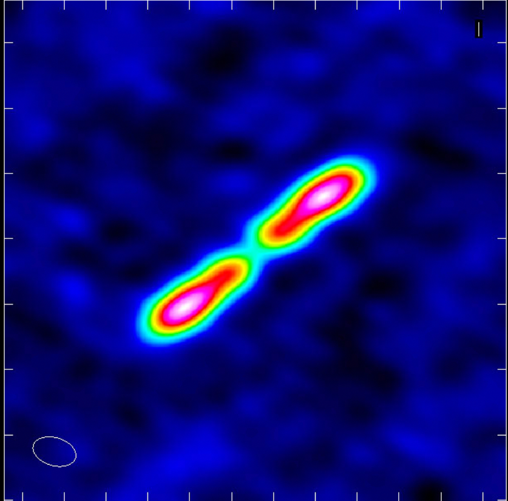

#  AU Mic Research Notes 


------------------------------------------------------------
#### 10/10/17: Fixing Model Grid Resolution 
We've been working on a run to investigate the limits of our spatial resolution, to certify that we have in fact resolve the disk scale height.
We fix the scale factor to 0.003 (~1/15 of the beam size). 
The model image had a bunch of grid resolution problems--it looked like a bunch of superimposed bowties, because the size of the sky plane azimuthal grid elements was too large.
I'm setting the number of azimuthal grid points ('nphi') to 251; this corresponds a grid element size of 1 au (~1/4-1/5 the beam size) at 40 au.

------------------------------------------------------------
#### 10/10/17: Total Disk Flux
cgcurs in=3sigma_image.im slev=a,1.49e-05 levs1=-3,3,6,9 device=/xs options=stats type=con region=arcsec,box'(-5,-5,5,5)'
Sum =  1.27731E+00   Flux density =  4.97180E-03 Jy
Minimum =  9.87927E-07  Maximum =  4.47913E-04 Jy/beam
Mean =  1.51681E-04  sigma =  8.36131E-05 from     8421 valid pixels
Data minimum at 231.00 pixels, 217.00 pixels
Data maximum at 256.00 pixels, 257.00 pixels
Data minimum at 20:45:09.903, -31:20:33.57
Data maximum at 20:45:09.845, -31:20:32.37
------------------------------------------------------------
#### 10/7/17: Final RMS for Journal figures

In response to concerns that the rms noise estimate from the journal-quality CASA cleans may be biased due to sidelobes/AU Mic's shape, I'm getting the rms from the residual clean maps.
I'm calling imstat on the *entire* region, since the noise actually goes down when I define the region as a box in the lower third of the image. 
Might as well use all the information we have!

| weighting         | CASA clean rms | residual clean rms |
|-------------------|----------------|--------------------|
| natural (no taper)| 1.48e-05       | 1.49e-05           |
| natural (taper)   | 1.92e-05       | 2.83e-05           |
Residual clean and dirty rms values were essentially identical. Unsure what causes this discrepancy for only the taper clean...

Noting that the residual rms values are higher, one would not be surprised to discover that using this rms value reduces the noise contours even more inthe journal-quality image--in fact, there are no noise contours.

------------------------------------------------------------
#### 10/6/17:

- imstat on $3\sigma$ region of band6_star_all.natural_clean.fits:

| Frequency   |    Velocity   |   Stokes | BrightnessUnit   |    BeamArea |
|-------------|---------------|----------|------------------|-------------|
| 2.21987e+11Hz   |       0km/s   |     I    |    Jy/beam     |   256.908 |
| Npts      |      Sum    | FluxDensity         |  Mean       |     Rms
| 9986 |   1.334832e+00   | 5.195759e-03   | 1.336703e-04   | 1.605511e-04
| Std dev        | Minimum        | Maximum   | region count
| 8.893642e-05  | -1.100369e-06   | 4.490895e-04       | 1

Total flux = Sum / (Npts/BeamArea) = 34.341mJy? 
<!-- Error = rms * Npts = 1.603263285 mJy -->

- star:
  - flux density $\to$ 4.490895e-04
  - coords $\to$ 20:45:09.845 -31.20.32.369
- NW ansa:
  - flux density $\to$ 3.291588e-04
  - coords $\to$ 20:45:09.693 -31.20.30.834
    - $\Delta \alpha = 0.152$ sec $=2.28''$
    - $\Delta \delta = 1.535''$
  - $\implies PA = 123.95$
  - --> 2.749" separation
- SE ansa:
  - flux density $\to$ 3.440531e-04
  - coords $\to$ 20:45:10.021 -31.20.34.179
    - $\Delta \alpha = -0.176$ sec $=-2.64''$
    - $\Delta \delta = -1.81''$
  - $\implies PA = 124.43$
  - --> 3.201" separation
------------------------------------------------------------
#### 7/27/17:
**Pomodoros:**
1.   Get CASA script going

Need to figure out a way to easily access observation rms for cleaning model images..
-   Hard code them into file?
-   Supply pathname to image for rms?

------------------------------------------------------------
#### 7/27/17:
**Pomodoros:**
1.   Make best fit function output visibilities ready for uvcat
2.   Get uvcat up and running
3.   Make residuals as well as convolved images, and start on casa script

------------------------------------------------------------
#### 7/27/17:
'run5_26walkers_10params' went a little wrong--the first june spw was actually a duplicate of an august spw, so I'm starting run 6 to better describe things.

------------------------------------------------------------
#### 7/16/17:
1000 step run with 16 walkers takes ~57 hours

In `run4_16walkers_7params`, `r_in` seems to prefer a very high value--about 25.
Meredith pointed out this may be because we are oversubtracting the stellar flux, so we've decided to use the unsubtracted visibilities and make the stellar flux a free parameter for each observation (so, three more free paramters).


------------------------------------------------------------
#### 6/30/17:
We have to treat each spectral window seperately, as `uvmodel` can't handle spectral windows. Thus, splitting out each spw and weighting seperately.

------------------------------------------------------------
#### 6/16/17: Reweighting

**note:** I changed the June visibilities name from `aumic_jun_noflare_allspws` to simply `aumic_jun_allspws` since we're certainly not using the flare anymore.


Now that I've (more or less) finished processing the visibilities, I need to reweight them using Kevin's code. There are three important factors for determining good weights:
1. `uvwidth:` the size of the box within which to search for neighboring visibilities in order to calculate standard devation/weight. This value is determined using the time smearing equation (3.194) from Essential Radio Astronomy:
    $$ \Delta t \ll \frac{\theta_s}{\Delta \theta} \frac{1}{2\pi} \implies \text{uvwidth} = 2\pi d_{uv} \Delta t $$
    where $\theta_s$ is the synthesized beam, $\Delta \theta$ is the largest phasecenter offset of concern, and $d_{uv}$ is the median $uv$ distance.
2. `nclose:` the number of points used to calculate the standard devation/weight. If there are not nclose visibilities within uvwidth, the weight is set to zero.
3. `acceptance fraction:` the fraction of points for which weights are sucessfully calculated.

I start by setting `nclose` to 50, and then increase/decrease `nclose` by 1 (while holding `uvwidth` fixed) until the acceptance fraction is just above 0.99.


The procedure to go from CASA `.ms` to correctly weighted visibilities of all file formats is as follows:

```python

#CASA
from glob import glob
mses = glob('*.uvsub.ms')
for ms in mses:
    exportuvfits(vis=ms, fitsfile = ms[:-3] + '.uvf')
    
#put at bottom of var_vis, then run:
uvfs = glob('*.uvsub.uvf')
for uvf in uvfs:
    final_name = uvf[:17] + '_FINAL'
    var_vis(uvf[:-4], final_name)
    create_vis(final_name)
    
#back to casa
from glob import glob
uvfs = glob('*FINAL.uvf')
for uvf in uvfs:
    importuvfits(fitsfile=uvf, vis=uvf[:-4]+'.ms')

```


------------------------------------------------------------
#### 6/16/17: Fixing March
Although I previously said that the March date seemed fine, visual inspection indicates that we are oversubtracting the stellar flux:


Because the March baselines are so short ($<450$ m), we are not able to obtain the star flux by fitting a point source to the longest baselines; the flux of the disk is present at even the longest baselines. 
As such, I am employing an image-domain approach. 
I fit a 24th order polynomial to the radial surface brightness profile of the disk, excluding the inner radii where stellar emission is present. 
Using the fit, I am able to derive an estimate of the disk flux at the location of the star, and thus find the star flux. 
Derived values can be found below.

| Component | Flux ($\mu$Jy) | 
|---|---|
| Disk | 781 |
| Star | 367 |

I use the following procedure to subtract the stellar flux from the March visibilities:
``` python
fixvis(vis = 'aumic_mar_allspws.concat.ms', 
    phasecenter = 'J2000 20:45:09.84238 -31.20.32.35898',
    outputvis = 'aumic_mar_allspws.fixvis.ms')
os.system('rm -rf point_fit.cl')
cl.addcomponent(flux=0.000367, fluxunit='Jy', shape='point', 
    dir='J2000 20:45:09.84238 -31.20.32.35898')  
cl.rename('point_fit.cl')  
cl.close()
ft(vis='aumic_mar_allspws.fixvis.ms', complist='point_fit.cl')
uvsub(vis='aumic_mar_allspws.fixvis.ms')
os.system('rm -rf aumic_mar_allspws.fixvis.uvsub.ms')
split(vis='aumic_mar_allspws.fixvis.ms',
    outputvis='aumic_mar_allspws.fixvis.uvsub.ms',
	datacolumn='corrected')
```
The resulting visibilities appear very slighltly oversubtracted, but it's good enough for now.

------------------------------------------------------------
#### 6/14/17: Final corrections on visibility files, and exclusion of flare 
Now that we a more reliable result for the June star position, Meredith and I have decided that it would be a good idea to re-subtract the stellar componenet from the actual star position, rather than the flare position. I apply `uvmodelfit` to the I used the following code to fit a point source to several different baseline ranges; the point source flux should converge to the stellar flux as the shorter baselines are excluded.
``` python
I = []
for i in range(0, 701, 50):
    uvmodelfit(junvis, uvrange='{}~1400'.format(i))
    flux = input("Flux? ")
    I.append(flux)
```

After visual inspection, I've decided that `uvrange='350~1400'` provides the best balance between excluding disk flux and including as many data points as possible.
This yields a stellar flux of `I = 0.000262055 +/- 9.40667e-09` Jy. 

The procedure for June is as follows: 
1.  Fix phasecenter:      
    ``` python
    fixvis(vis = 'aumic_jun_noflare_allspws.concat.ms', 
        phasecenter = 'J2000 20:45:09.871593 -31.20.32.838199',
        outputvis = 'aumic_jun_noflare_allspws.fixvis.ms')
    ```
2.  Subtract stellar component, and split out corrected data:
    ``` python
    cl.addcomponent(flux=0.000262055, fluxunit='Jy', shape='point', 
        dir='J2000 20:45:09.871593 -31.20.32.838199')  
    cl.rename('point_fit.cl')  
    cl.close()
    ft(vis='aumic_jun_noflare_allspws.fixvis.ms', complist='point_fit.cl')
    uvsub(vis='aumic_jun_noflare_allspws.fixvis.ms')
    split(vis='aumic_jun_noflare_allspws.fixvis.ms',
        outputvis='aumic_jun_noflare_allspws.fixvis.uvsub.ms',
    	datacolumn='corrected')
   ```
3.  Now, pull all files from the `24jun2015_flare_main`, which contains all flare-subtracted visibilities, and concatenate into single file:
``` python
import subprocess
from glob import glob
files = glob("../24jun2015_flare_reduced/*.uvsub")
concat(vis=files, concatvis='aumic_jun_flare_allspws.fixvis.uvsub.ms')
```
When the output vis is cleaned, some stellar emission clearly remains. This is weird, because I haven't seen stellar emission in any of the previously made clean images... 

***Given the difficulties that I experienced with the bad spectral window during the flare timewindow, the persistent flare/stellar flux in the supposedly corrected flare visibilities, and general uncertainty about how we fit the point sources to the star/flare the first time around, I'm deciding to fully eliminate the flare timewindow (4:23:38-4:29:58) from the data we use for imaging and modeling.***

------------------------------------------------------------
**Other dates:** I went back to re-check March and August using a for loop similar to that above---March seems fine, but I'm redoing August. I went with `uvrange='500~1200`, which yields `I = 0.00012281 +/- 1.17063e-08`. Jy The procedure is as follows:

1.  Fix phasecenter:      
    ``` python
    fixvis(vis = 'aumic_aug_allspws.concat.ms', 
        phasecenter = 'J2000 20:45:09.85274 -31.20.32.50258',
        outputvis = 'aumic_aug_allspws.fixvis.ms')
    ```
        
2.  Subtract stellar component, and split out corrected data:
    ``` python
    cl.addcomponent(flux=0.00012281, fluxunit='Jy', shape='point', 
        dir='J2000 20:45:09.85274 -31.20.32.50258')  
    cl.rename('point_fit.cl')  
    cl.close()
    ft(vis='aumic_aug_allspws.fixvis.ms', complist='point_fit.cl')
    uvsub(vis='aumic_aug_allspws.fixvis.ms')
    split(vis='aumic_aug_allspws.fixvis.ms',
        outputvis='aumic_aug_allspws.fixvis.uvsub.ms',
    	datacolumn='corrected')
    ```

For **March**, all we have to do is phase shift:  
``` python
fixvis(vis = 'aumic_mar_allspws.concat.ms', 
    phasecenter = 'J2000 20:45:09.84238 -31.20.32.35898',
    outputvis = 'aumic_mar_allspws.fixvis.ms')
```

For consistency, I'm also creating a copy called `aumic_mar_allspws.fixvis.uvsub.ms`

------------------------------------------------------------
#### 6/13/17: Position fixing: imfit on non-flare component of June date
A different method to fix the June flare offset problem: if the flare is indeed asymmetric and pulled the imfit position away from the true star position, this can be remedied by calling imfit on the non-flare part of the June observation. First,
I will use March and August as controls.

*Methods:* Concatenate all four pre-fixvis and -uvsub spws (i.e. before phase shifting and stellar component subtraction), use this to fit. Make sure region around star is a very small circle, so that any irregularities at the edges of the smeared point source don't affect fit position

##### March:  
    ra:   20:45:09.84238 +/- 0.00033 s (0.00426 arcsec along great circle)  
    dec: -31.20.32.35898 +/- 0.00223 arcsec  
    Peak: 771.3 +/- 4.7 uJy/beam    
    
Compare to previously used imfit values:

    All times
    ra:   20:45:09.843230 +/- 0.000062 s (0.000800 arcsec along great circle)
    dec: -31.20.32.358302 +/- 0.000378 arcsec
    Peak: 755.40 +/- 0.82 uJy/beam

    Fixvis phase center:
    J2000 20h45m09.8443s -031d20m32.36s

##### August:  
    ra:   20:45:09.85274 +/- 0.00016 s (0.00200 arcsec along great circle)
    dec: -31.20.32.50258 +/- 0.00182 arcsec
    Peak: 226.5 +/- 2.5 uJy/beam
Compare to previously used imfit values:

    ra:   20:45:09.85471 +/- 0.00077 s (0.00984 arcsec along great circle)
    dec: -31.20.32.52039 +/- 0.00717 arcsec
    Peak: 225.1 +/- 10.0 uJy/beam

    Fixvis phase center:
    J2000 20h45m09.85471s -031d20m32.52034s
    
##### June:  
    ra:   20:45:09.871593 +/- 0.000061 s (0.000778 arcsec along great circle)
    dec: -31.20.32.838199 +/- 0.000479 arcsec
    Peak: 378.9 +/- 1.3 uJy/beam
Compare to previously used imfit values:

    All times
    ra:   20:45:09.86765 +/- 0.00016 s (0.00203 arcsec along great circle)
    dec: -31.20.32.88803 +/- 0.00128 arcsec
    Peak: 862.3 +/- 7.7 uJy/beam

    Fixvis phase center:
    J2000 20h45m09.8677s -031d20m32.89s

For all dates, the imfit coordinates are just about exactly at the stellar emission (by visual inspection). For June, the previously used coordinates are significantly below and to the right of the star position.

------------------------------------------------------------
####5/31/17: First day of summer research
- Relative position uncertainty (per synthesized beam) = $\frac{\theta_{sb}}{SNR}$
- $\to$ Fixvis phasecenter

------------------------------------------------------------
####5/28/17: Star position
Sooo it's been a while since I've written any notes. In the last month and a half,
I have:

1.  Cutting out the last observation window for **(just spw3? all spws?)** fixed the flare date.
2.  While concatenating the different dates before cleaning may have helped with the star offset from the image center, this effect remains. Meredith and I wonder if the flare could have been asymmetric, so that the point source fit to the flaring star that defines the image center is offset from the star itself. This would also explain the asymmetric gap/hole by the star in the June observation.
3.  To fix this issue, I hope to find some metric of determining the center/star position of the disk that gives good agreement with august and march dates and apply it to the June date.

##### Approaches:
-   `pixel_mean:` take the mean position of all pixels with values above 6.2 $\sigma$ 
    -   mar offset from image center: $(0.0, 0.03)$ 
    -   aug offset from image cenger: $(0.0, 0.0)$
    -   jun offset from image center: $(0.06, -0.18)$
        -   visual inspection shows that this is on the wrong side of the disk...
-   `single_gauss:` fit a Gaussian to the whole disk
    -   mar offset from image center: $(-0.04, 0.02)$
    -   aug offset from image center: $(0.07, -0.03)$
    -   jun offset from image center: $(0.25, -0.10)$
-   `double_gauss:` fit a Gaussian to each side of the disk
    -   mar offset from image center: $(0.01, -0.06)$
    -   aug offset from image center: $(0, 0.06)$
    -   jun offset from image center: $(0.13, 0.09)$
-   `clean_pixels:` run clean with a low number of iterations, select the brightest pixel on each side of the disk from the clean component map
    -   March:
        -   NW side: `20:45:09.682  -31.20.30.767`, $(6.77\times10^{-5})$ Jy
        -   SE side: `20:45:10.012  -31.20.34.047`, $(6.78\times10^{-5})$ Jy
        -   Mean: $\to$ `20:45:9.847 -31.20.32.407`; 
        -   Pointing center: `20:45:09.84 -31:20:32.36`
        -   Offset: `0.01 -0.05` arcsec
    -   August:
        -   NW side: `20:45:09.68  -31.20.30.75`, $(3.69\times10^{-5})$ Jy
        -   SE side: `20:45:10.03  -31.20.34.29`, $(3.24\times10^{-5})$ Jy
        -   Mean: $\to$ `20:45:9.855 -31.20.32.52`; 
        -   Pointing center: `20:45:09.85  -31:20:32.52`
        -   Offset: `0.01 0.00` arcsec
    -   June:
        -   NW side: `20:45:09.702  -31.20.31.099`, $(1.03\times10^{-4})$ Jy
        -   SE side: `20:45:10.036  -31.20.34.504`, $(6.70\times10^{-4})$ Jy
        -   Mean: $\to$ `20:45:09.869 -31.20.32.802`; 
        -   Pointing center: `20:45:09.87 -31:20:32.89`
        -   Offset: `0.00 0.09` arcsec  

The 'clean pixel' method gives the best agreement for the March and August dates,
and we will use this method going forward. The coordinates calculated above will
be used as the new phasecenters (`fixvis` will be applied to all three dates for
consistency).

------------------------------------------------------------
####4/8/17: Final iteration of data files?

Aug $\chi^2$|Jun $\chi^2$|Mar $\chi^2$
------------ | -------------- | ------------
0.96209719   | 2.77836548     | 1.9568517
0.96680418   | 2.52863844     | 1.96150345
0.97191927   | 2.59185666     | 1.97182168
1.02544892   | **1.74236074** | 1.97257757

Aug $\chi^2$ | Jun $\chi^2$   | Mar $\chi^2$
------------ | -------------- | ------------
0.96209719   | 2.77836548     | 1.9568517
0.96680418   | 2.52863844     | 1.96150345
0.97191927   | 2.59185666     | 1.97182168
1.02544892   | **2.29280139** | 1.97257757

---
####3/21/17: Pixel location:

- ctrpix remains the same if I make image 257 pixels
- `interpolate.rotate` works on arrays, and does not mention a rotation centroid--I assume it must choose the float center point of the array

CRPIXn from FITS standard:

> The value field shall contain a floating point number, identifying the location of a reference point along axis n, in units of the axis index. This value is based upon a counter that runs from 1 to NAXISn with an increment of 1 per pixel. The reference point value need not be that for the center of a pixel nor lie within the actual data array. Use comments to indicate the location of the index point relative to the pixel.

From STSCI:

> When the data matrix represents a digital image, transformation between the data matrix and the physical picture requires knowledge of where in the pixel -- center or corner -- the data point is. Historically, astronomers have generally assumed that the index point in a FITS file represents the center of a pixel. This interpretation is endorsed by GC. It differs from the common practice in computer graphics of treating the center of a pixel as a half-integral point. GC note that the pixel in a FITS file is commonly regarded as a volume element in physical space, which might be viewed from different perspectives via transposition and rotation. Under such operations, only the center of an element remains invariant. Pending adoption of a standard convention by the astronomical community, FITS writers should use appropriate comments in the comment field of the card image or the COMMENT keyword to inform readers of the file which convention is being used. Once the community has accepted a convention, a single comment noting that the convention is being used will be sufficient.

--------------------------------------------------------------------------------

####3/21/17: Flare date and bad spws

Recently I realized that the time window we split out to fix the bad spw in the June date was exactly the time window of the flare. This makes me somewhat suspicious, and Meredith and I decided I should do some more digging, espcially considering all the work we put into making the flare data useable.

The `plotms` of amp vs. time for spw3 (the bad one) and spw1 (well behaved) are roughly the same--both show a huge spike in the last (flare) time window. This leads me to believe that it's not the flare itself that's messing up spw3; if this were the case, we should see the same thing for spw1.

- Antenna 1 and 2 are almost constantly 'on' in last time window, as opposed to dashed in previous windows?
- same for baseline, phase
- weights get very low for in flare window for both spws
- everything I tried seems to match for both spws...

This is a little confusing, since spw1 had a pretty nice $\chi^2$; but we did remove that flare time window for _all_ spws...

--------------------------------------------------------------------------------

<br>

####2/26/17---3/20/17: Image Centering

While comparing images made with different date combinations (i.e. removing August date because of poor quality), I noticed that the disk was offset from the image center for certain combinations. We have decided that this is caused by the non-homogeneous pointing centers (due to proper motion) of the three datasets. When `tclean` is called on a collection of datasets with different pointing centers, the pointing center of the first of the datasets is chosen as the origin of the image, and all datasets are combined in the _uv_-domain, with their phase offsets preserved. The resulting sky-domain image is both offset from the image center and a false representation of the disk.

To fix this issue, I tried using `contcat` with its _dirtol_ parameter set to a high value (2"). As long as the pointing/phase centers of the datasets do not differ from each other by more than _dirtol_, the datasets are combined as if they all share the pointing center of the first dataset and all is well. A quick test indicates that this method is succesful.

However, I ran into another problem while attempting the `concat` method. The `26mar2014_aumic_spw0.corrected_weights.ms` dataset is missing `table.f8_TSM1` (all other datasets have this table), and because of this `concat` fails when applied to this dataset. However, recreating the `.ms` file from the corresponding `.uvf` file seems to have fixed this problem. I'm starting over with a `cleans` directory, and have added the suffix `_old` to the originals.

--------------------------------------------------------------------------------

**_My troubleshooting notes:_**

**Fixvis:** `If the phase center is changed, the corresponding modifications are applied to the visibility columns given by the parameter "datacolumn" which is by default set to "all" (DATA, CORRECTED, and MODEL).`

- All dates have 257, 257 `CRPIX`

  - 24 June: 311.291115417 -31.3424694444

- 24 June fixvis: `phasecenter = J2000 20h45m09.8677s -031d20m32.89s`

  - not many precision points?
  - 311.2911154166666 -31.342469444444443 in deg... essentially the same as the image center

- Center pixel info for all dates:

  - aumic_18aug_usermask_natural:

    - 311.2910612917 -31.34236676111

  - aumic_26mar_usermask_natural

    - 311.2910179167 -31.34232222222

  - aumic_24jun_usermask_natural

    - 311.291115417 -31.3424694444

  - aumic_usermask_natural

    - 311.2910612917 -31.34236676111

  - aumic_marjune_usermask_natural

    - 311.291115417 -31.3424694444 March + June (the culprit):

  - 311.291115417 -31.3424694444

  - 257 257 center pixel
